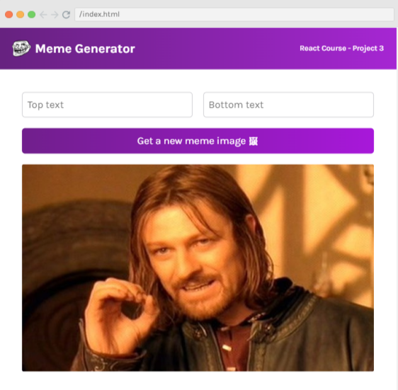
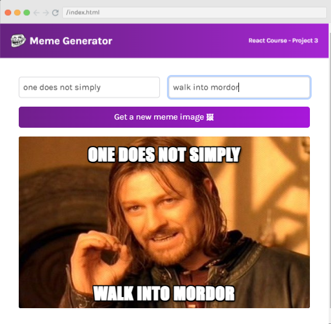
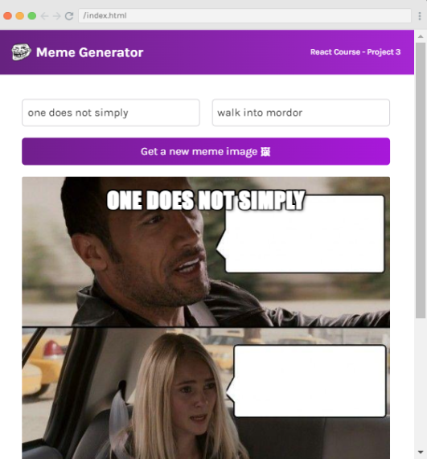

# React Project: Meme Generator

## Description:
This is a dynamic react app used to generate amazing memes. Users can create any memes by writing any text and then generate random images.

## Tech Stack:
- HTML
- CSS
- JavaScript
- React
- API Calls
- React Hooks

## Output:





Quick start:

```
$ yarn # npm install
$ yarn build # npm run build
````

## Development

Run Webpack in watch-mode to continually compile the JavaScript as you work:

```
$ yarn watch # npm run watch
```

Happy Coding!
